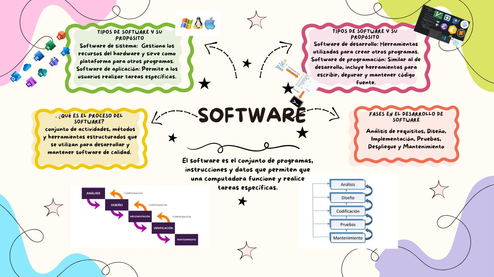

## 1. ¿Qué es el software? 
El software es el conjunto de programas, instrucciones y datos que permiten que una computadora funcione y realice tareas específicas. Es la parte intangible del sistema informático, que interactúa con el hardware para procesar información y ejecutar aplicaciones. 
### Ejemplo: Sistemas operativos, aplicaciones, videojuegos, entre otros. 

## 2. Tipos de software y su propósito 
*Software de sistema o Descripción:* Gestiona los recursos del hardware y sirve como plataforma para otros programas. 
### Ejemplos: Sistemas operativos (Windows, macOS, Linux), controladores de dispositivos. 
*Software de aplicación o Descripción:* Permite a los usuarios realizar tareas específicas. 
### Ejemplos: Microsoft Word (procesador de texto), navegadores web (Google Chrome), aplicaciones móviles. 
*Software de desarrollo o Descripción:* Herramientas utilizadas para crear otros programas. 
### Ejemplos: Editores de código (Visual Studio Code), compiladores, entornos de desarrollo integrado (Eclipse). 
*Software de programación o Descripción:* Similar al de desarrollo, incluye herramientas para escribir, depurar y mantener código fuente. 
### Ejemplos: Intérpretes y depuradores

## 3. ¿Qué es el proceso del software? 
El proceso del software es un conjunto de actividades, métodos y herramientas estructuradas que se utilizan para desarrollar y mantener software de calidad. Este proceso busca optimizar recursos y garantizar que el producto final cumpla con los requerimientos del cliente. 

## 4. Fases en el desarrollo de software 
 ### Análisis de requisitos 
*Acciones:* 
- Identificar necesidades del cliente. 
- Documentar requisitos funcionales y no funcionales. 
- Crear especificaciones detalladas. 
 ### Diseño 
*Acciones:* 
- Diseñar la arquitectura del sistema. 
- Crear diagramas de flujo, modelos de datos y prototipos. 
- Planificar la estructura del código. 
 ### Implementación 
*Acciones:* 
- Escribir el código fuente. 
- Integrar componentes desarrollados. 
- Realizar pruebas unitarias. 
 ### Pruebas 
*Acciones:* 
- Verificar que el software funcione según lo esperado. 
- Identificar y corregir errores. 
- Realizar pruebas funcionales, de integración y de usuario. 
 ### Despliegue 
*Acciones:*
- Instalar el software en el entorno del cliente. 
- Configurar el sistema según los requisitos. 
- Ofrecer capacitación al usuario final. 
 ### Mantenimiento 
*Acciones:* 
- Resolver errores encontrados después del despliegue. 
- Mejorar el software con nuevas funcionalidades.
- Optimizar el rendimiento. 

## Conclusiones
**Garnica Ximena:** el desarrollo de software no solo implica la creación de un producto tecnológico, sino también la aplicación de principios de ingeniería y metodologías que permiten la resolución de problemas reales. Este enfoque estructurado asegura que el software sea una herramienta confiable y efectiva en un mundo cada vez más digitalizado. 

**Garcia Itzel**: los diversos software que existen en la actualidad hacen que nuestra vida sea un tanto más sencilla, gracias a la manera en que están siendo programados, la interacción entre máquina-humano se vuelve cada vez más fácil. ¿Qué sería de nosotros sin el software que utilizan las grandes cadenas de supermercados a la hora de cobrar? ¿Qué sería de nosotros sin whatsApp, facebook o instagram?

## Bibliografía 
-  *Sommerville, I. (2016).* Ingeniería del software (10.a ed.). Pearson Educación. Referencia clave para conceptos de software y procesos de desarrollo. 
-  *Pressman, R. S., & Maxim, B. R. (2020).* Software Engineering: A Practitioner's Approach (9.a ed.). McGraw-Hill Education. Incluye detalles sobre tipos de software y fases del desarrollo. 
- *Boehm, B. W. (1988).* A Spiral Model of Software Development and Enhancement. ACM SIGSOFT Software Engineering Notes, 11(4), 14–24. Discusión sobre los procesos iterativos y las fases en el desarrollo de software

